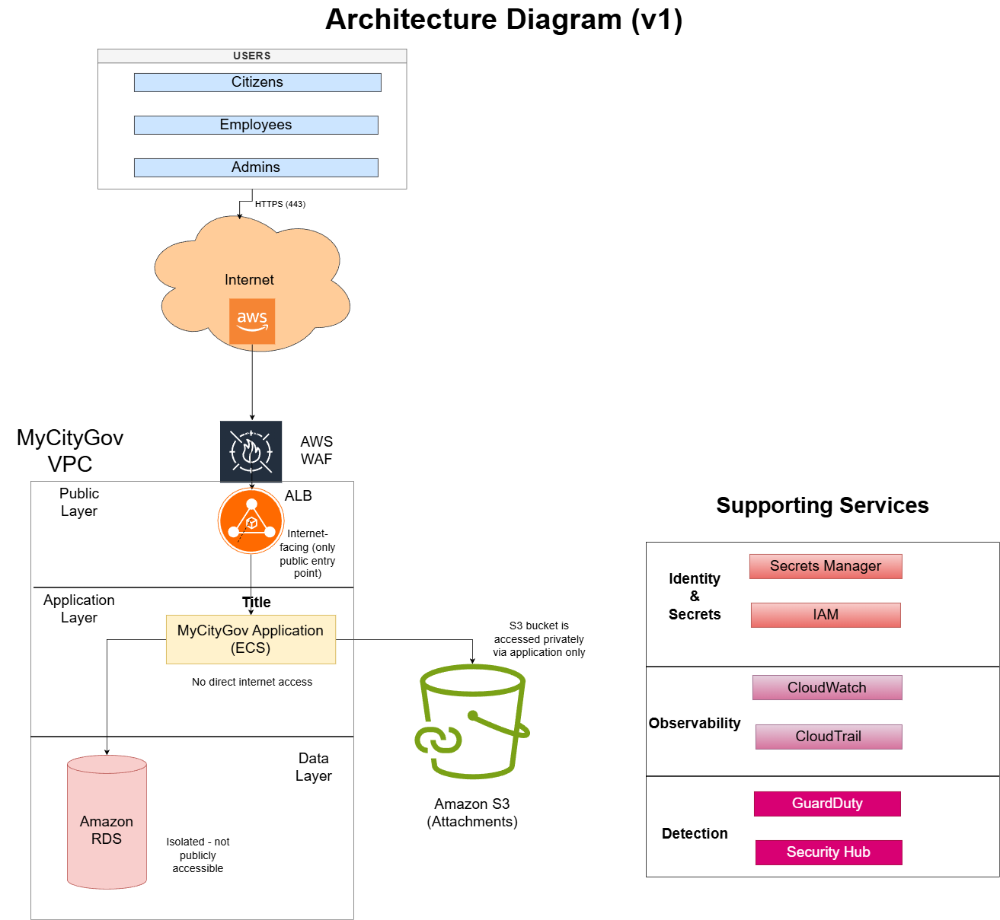
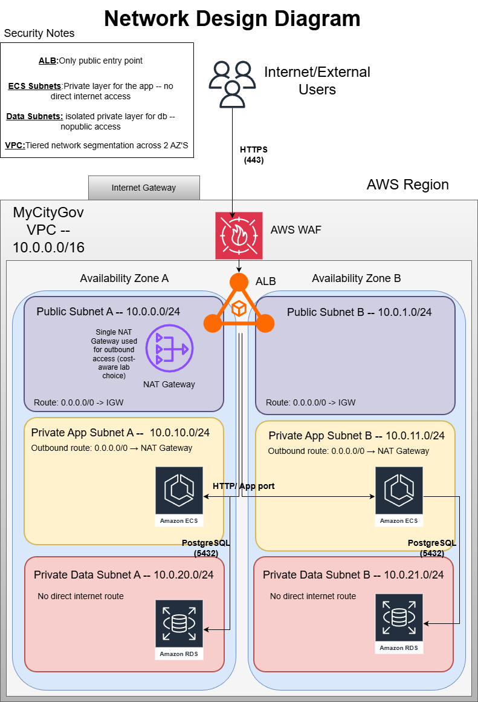

# Architecture Overview

## Project Scope

MyCityGov is a portfolio-grade secure cloud deployment project that models a municipal digital services platform on AWS. The application was made by me for an academic project .It enables citizens to submit digital service requests, report city issues, upload supporting documents, and schedule appointments with municipal departments, while employees and administrators process requests and manage service workflows.The scope of this project focuses on designing and implementing a secure multi-tier AWS infrastructure for the application, including segmented networking, secure workload hosting, protected data storage, IAM least privilege, secrets management, Infrastructure as Code, DevSecOps controls, centralized logging, threat detection, and a basic incident response automation workflow. The primary goal is not feature development of the application itself, but the secure, repeatable, auditable, and production-style cloud architecture around it.

## Security Goals

The security design and the architecture decisions of the system is guided by the following goals:

1) Minimize public exposure
Only the required public entry point should be exposed to the internet. Application and database components must remain in private network segments.
2) Enforce isolation
The web entry layer, application layer, and data layer must be logically separated to reduce lateral movement opportunities and contain failure or damage.\
3) Protect sensitive citizen and service data
PII,request metadata, appointment information,case handling details and uploaded documents must be protected through access control, encryption, and exposure minimization
4) Enforce principle of least privilege
Human users, workloads, automation, and AWS services must receive only the permissions required for their specific responsibilities.
5) Eliminate insecure secret handling
No sensitive credentials or secrets should be hardcoded in code repositories, configuration files, or CI/CD workflows.
6) Enable traceability and auditability
Administrative actions, security-relevant API activity, and application behavior must be logged to support investigation, accountability, and validation.
7) Detect suspicious activity and misconfiguration
The environment must provide visibility into cloud threats, anomalous behavior, and insecure configuration states.
8) Support controlled and repeatable delivery
CI/CD with embedded security-quality checks/container security seperate controlled release and deploy logic.
9) Demonstrate basic response readiness
At least one security event must trigger a documented detection-to-response workflow.

## Architecture Decisions

### Application Layer — ECS Fargate

Runs in private subnets with no direct internet access, reducing attack surface and enforcing isolation (SG-1, SG-2). IAM task roles enable least privilege access (SG-4).

### Data Layer — RDS PostgreSQL

Deployed in private subnets with restricted access from the application only, ensuring data isolation and protection (SG-2, SG-3).

### Object Storage — S3

Used for attachments with public access blocked and IAM-controlled access, supporting secure data handling (SG-3, SG-4).

### Public Entry — ALB + WAF

ALB is the only internet-facing component, with HTTPS and WAF protection to minimize exposure and filter malicious traffic (SG-1, SG-7).

### Network Design — Segmented VPC

Public, application, and data subnets across multiple AZs enforce strict tier separation and limit lateral movement (SG-2).

### Secrets Management — Secrets Manager

Secrets are centrally stored and accessed at runtime, eliminating hardcoded credentials (SG-5).

### Identity and Access — IAM Roles

Separate roles for users, services, and automation enforce least privilege and reduce blast radius (SG-4).

### Logging & Monitoring — CloudWatch & CloudTrail

Centralized logging enables traceability, auditing, and investigation (SG-6).

### Threat Detection — GuardDuty, Security Hub, Config

Provides visibility into threats and misconfigurations across the environment (SG-7).

### Infrastructure as Code — Terraform

All infrastructure is defined as code to ensure consistency and controlled changes (SG-8).

### CI/CD — GitHub Actions

Pipeline enforces automated validation and controlled deployments with secure access to AWS (SG-8, SG-5).

## Security Assumptions and Constraints

- The system is implemented as a portfolio project and not as a production  system. Some design decisions are influenced by simplicity and cost rather than full production requirements.

- The deployment is based on a single AWS account. In a real-world setup and always proportional to the company's needs , separate accounts (e.g. for production, staging, and security) would normally be used.

- High availability and fault tolerance are considered, but not fully optimized (e.g. cost-driven decisions such as limited use of NAT Gateways may apply).

- The application itself is reused from a previous academic project. The focus here is on securing the infrastructure and deployment environment rather than redesigning the application from scratch.Threfore the source code of the application is student-like and best-practices aren not applied.

## Archtecture Diagram v1

This is an early design high-level architecture diagram of the system

## Network Design Summary

The network is built inside a dedicated custom VPC using the IPv4 range `10.0.0.0/16`.

This range was selected because it is private, easy to manage, and simple to split into clearly separated subnets.

The VPC is spread across two Availability Zones in order to support a more resilient and production-style design. Each layer of the system is placed in both zones so that the architecture does not depend on a single Availability Zone.

The subnet layout is divided into three tiers:

- **Public subnets** for the internet-facing Application Load Balancer
- **Private application subnets** for the ECS service
- **Private data subnets** for the RDS database

The subnet allocation is as follows:

- Public Subnet A: `10.0.0.0/24`
- Public Subnet B: `10.0.1.0/24`
- Private App Subnet A: `10.0.10.0/24`
- Private App Subnet B: `10.0.11.0/24`
- Private Data Subnet A: `10.0.20.0/24`
- Private Data Subnet B: `10.0.21.0/24`

The numbering is intentionally separated by tier so that the network remains easy to understand and extend later.

Only the load balancer is placed in the public layer. The application and database layers remain private. Public subnets route internet-bound traffic through the Internet Gateway. Private application subnets use a NAT Gateway for outbound access when needed. Private data subnets do not have a direct route to the internet.

This design keeps the public attack surface limited, supports logical separation between tiers, and provides a clean foundation for later implementation in Terraform.

### Initial Network Diagram

